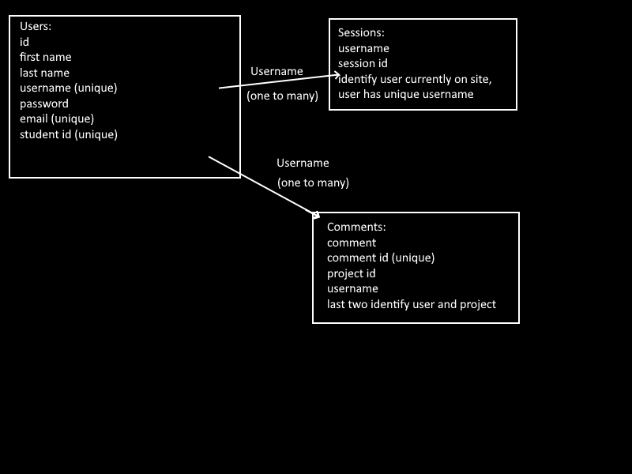
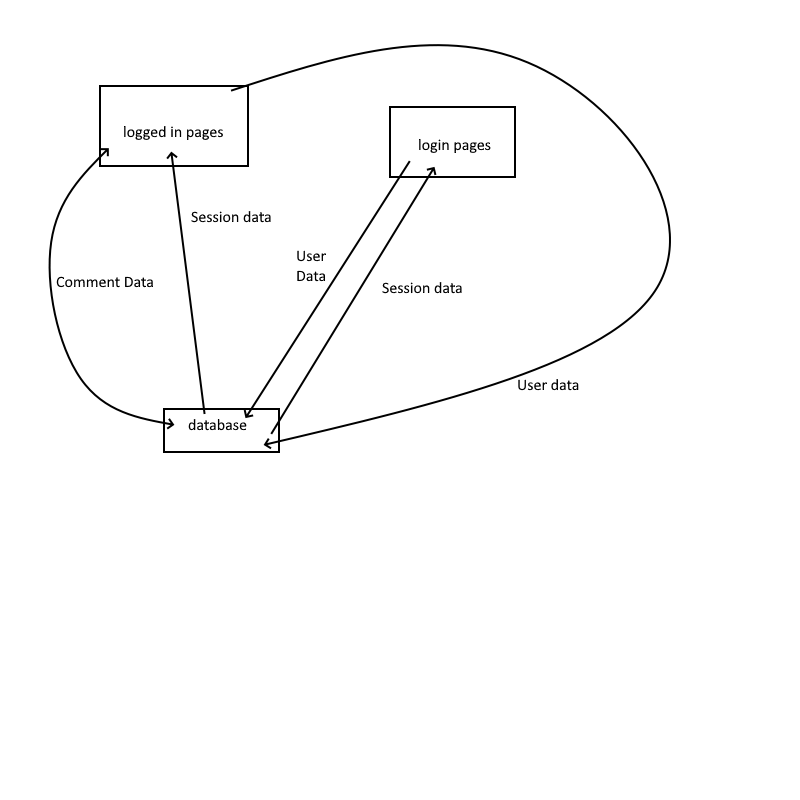

# Final Tech Assigment 
## William Shieh 
## PID: A16331269

 

## Challenges

Needs initdb.py to be run before starting the server.

 

We needed to create a website with login and register features and sessions once logged in, a page to edit the user data associated with the logged in account, a page with multiple pages of text, and a page that called from an outside api, sorted an array of data pulled and organized from many api calls, and had ways to add, edit, and delete comments. 

I used code from the in-class activities to create databases for the users and sessions, I used lots of old code from other tech assignments to create the JS and HTML for each page, and I did a lot of debugging to make everything work properly.

The 3 things I did for extra credit were Session Expiry, Editing Leaderboard Comments, and possibly the CSS for a better UI though probably not quite enough.

I did what I could LMAO

Video: https://youtu.be/nbMj6lVEbL4 

# Information Architecture

# Database Schema Design

# System Design

